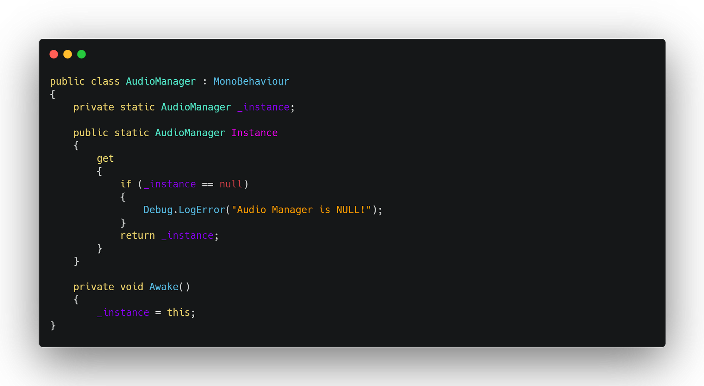

<h1>
Composing with Design Patterns
</h1>

When I first started learning how to code, it felt a lot like learning to play an instrument. At first, you just want to be able to hit the right notes (the two intrusments I learned are the Trumpet and Trombone), or write code that runs with no errors. But eventually, you start realizing theres a big difference between just making sound and actually making music.

Thats kind of what design patterns are. They're not code you copy and paste, they're more like the musical structures behind a good song. They help you organize your code in a way that sounds better, feels cleaner, and makes more sense to other developers. And just like how musicians use familiar progressions, developers use design patterns as building blocks to solve common problems.

The design pattern I really got comfortable with was the singleton pattern. During a group project for ICS 485 Video Game Design and Development, we built an RPG called Belonging using Unity. It was my first time ever using Unity, so learning how everything works was a job in itself.  I was the person in charge of actually making the soundtrack for our game, which was chill work at first because I mainly worked in MuseScore(the application I use to make the music).  However, I did end up having to use Unity so I can add the music into our game.  We needed the background music to flow smoothly between scenes.  At first, every new scene kept starting with a fresh audio source. It was like having multiple DJs jumping in at random, all trying to play their own tracks. After much research, using the Singleton pattern, I created a single AudioManager that persisted across scenes. This allowed for the music to stay in sync and keep playing between scenes unless the area changed the music.  

