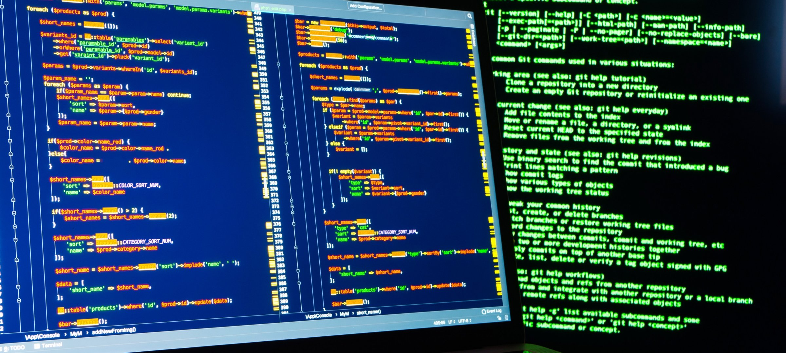

<h1>
Software Engineering II
</h1>

This class was pretty fun; unlike ICS 314, at the start of the semester, we're immediately thrown into randomly assigned groups to work on a BIG project throughout the semester.  I was a bit nervous at first because after the first day of class, there only remained 4 people total, including me, in our group when we're supposed to have around 8 or 9 people per group.  We stuck with it for a little bit, and even named ourselves Tiny Team because of the lack of people in our group.  However, it was decided it was better to split the 4 of us up and put us in the other groups so the workload is more easier.

And thus, my work with my new group, Party Pantry, began.  I was a bit shy because at that point, its already been 1 or 2 weeks into the semester, and everyone in the group already seemed like they know each other and are comfortable. Luckily, when Tiny Team was disbursed, one of my team members came with me; so I felt a little more comfortable knowing at least one person.  However, I quickly made friends with many of the people in Party Pantry, and have come to learn that many of them were also in my ICS 312 class, and a couple in my ICS 332 class.  So, throughout the semester, I gradually became more comfortable with them, enough so I can call them my friends.  

At one point in the semester, it was one of my group mates birthday.  And surprisingly enough, we actually met outside of class and spent time together, we had dinner and did an escape room.  Unfortunately, not everyone in the group was able to make it, but for the people who did, I already knew so I found it to be really fun; and if you ask me, I think doing some kind of team bonding thing is good for these group projects.  I did something similar when taking ICS 485: Video Game Design, I bought all my group mates who didn't own the game REPO and one night we all sat down and played it together.  Something about building that chemistry helps with group projects because on the nights where we would work on our game in call all together, we would get a good amount of work done.  There were nights just like that for this class where a couple of us would work on the project whilst in a call together.  

Overall, this class was nice in the sense that we only need to meet every other week for Milestone checkins of our project, which I was so thankful for because I live on the West side and this class was at 9AM, so fighting that morning traffic is never fun. I would have hated to do 9AM class twice a week, weekly.  In terms of working on the project and getting the work done, I feel like it was very FREE in the sense that, at least for my issues, I did not need to depend on someone to finish their issue first before working on mine.  Most of the semester, I would just work on my assigned issue whenever I had the chance to, which is dangerous if you're a procrastinator or poor time management skills / discipline.  But overall, as a graduating senior this semester, I would reccommend taking this class, as the professor said, this is an easy class.  I think I'm also thankful I had a wonderful group with wonderful people, we got a lot of our work done in a timely manner.
