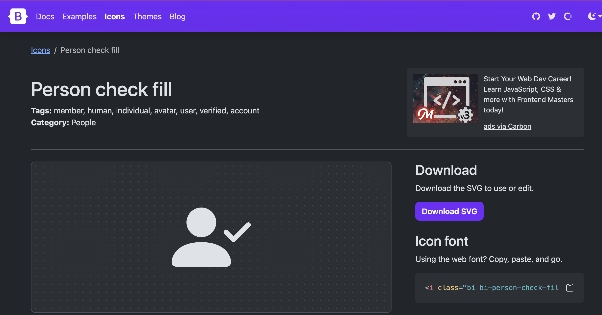

<h1>
Overall thoughts on UI Frameworks
</h1>

I think UI Frameworks, despite it being just as hard to learn as a new programming language, is very useful.  It creates more ways for us to accomplish getting certain tasks done without needing to use raw HTML and CSS.

<h2>
Why bother using stuff like Bootstrap 5?
</h2>

After working on the islandsnow WOD and having to recreate a website of my own choice, I thought that Bootstrap 5 was VERY helpful because of the amount of things we could do with it; an example being that Bootstrap has icons which we can just link one and then use in our code.  It's definetly a lot easier using those icons for certain things compared to having to find a image of what we want, uploading it to our local save, then having to link it into our code via img src=...  

  
  
This is what using Bootstrap icons look like, overall less code to write and very simple to use.

  
  
This is an example of using an image you upload to the local save. It’s simple but doesn't look as clean as using Bootstrap icons, and a lot more work with having to go and find an image you want, download it, and link it like this.

  
  
More content goes here...

And that's just scratching the surface with what Bootstrap 5 has to offer.  Bootstrap 5 has a ton of other prebuilt compenents that we can use, such as Navbars and Buttons.  I don't recall having to make navbars or buttons through raw CSS and HTML, but I can definitely say that learning how to use and make the navbars and buttons via Bootstrap was pretty simple and easy for me to understand.  Overall I think using Bootstrap over raw CSS and HTML requires overall less code when it comes to making user interfaces.  

