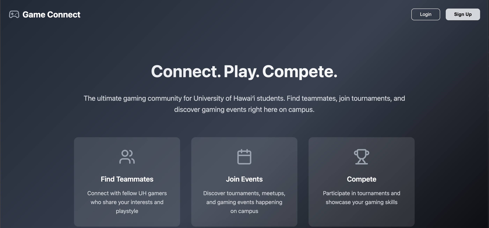

<h1>
Overview
</h1>

Gamers Connect is a full-stack platform built for students at the University of Hawai‘i to discover and connect with local gamers. Users can create personalized profiles, find teammates based on games and playstyle, organize gaming sessions, and browse nearby tournaments or meetups.

The app features intelligent player matching, session scheduling, and a clean, responsive UI.

Our github page:
[https://gamers-connect.github.io/](https://gamers-connect.github.io/)

Live application:
[https://uh-gamers-connect.vercel.app/](https://uh-gamers-connect.vercel.app/)
