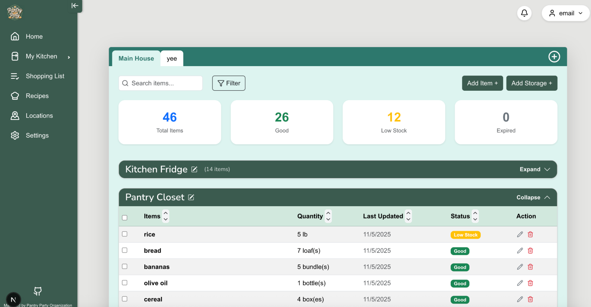

<h1>
Overview
</h1>

Party Pantry is a web-based inventory management application designed to help users organize and track food and household items across multiple storage locations, such as homes, freezers, refrigerators, and spice racks. The application enables users to monitor and update their pantry inventory in real time by creating customizable storage spaces and adding items to their corresponding locations.

Our github page:
[https://party-pantry.github.io/](https://party-pantry.github.io/)

Live application:
[https://pantry-party-delta.vercel.app/](https://pantry-party-delta.vercel.app/)
