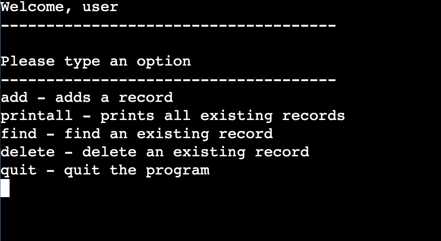
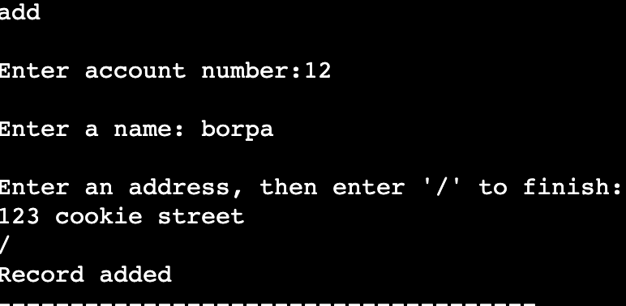
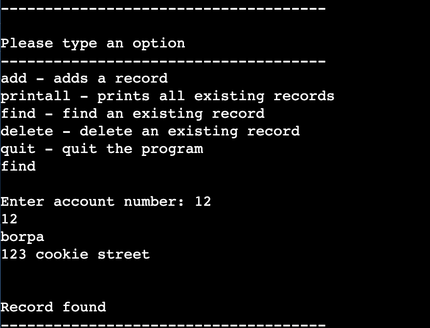
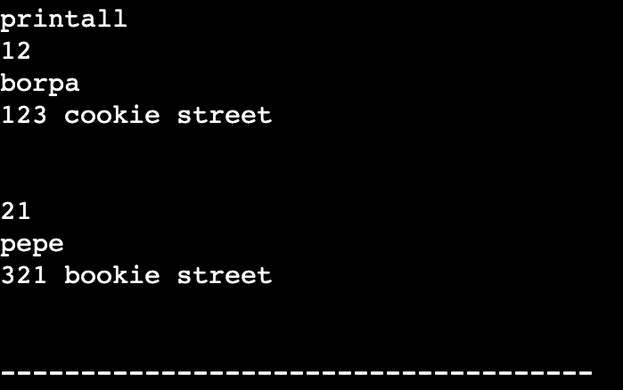

This project was slowly implemented over time throughout the semester, in which we implemented each method at a time, slowly building this project as a whole.  I'll give a small preview on the database working.

Adding a record to the database.

Finding the record in the database.

Printing all existing records in the database.

For this code to work, you need all of these files:

database.c

database.h

record.h

user_interface.c

Makefile(for easier compiling)

Unfortunately this project was done on UNIX, so we worked on this through terminal, so there's no 'nice' user interface.  

