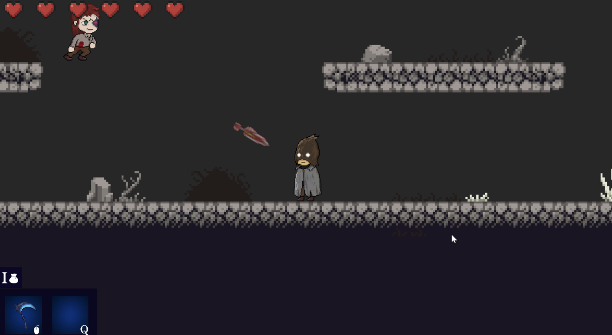

Belonging is a story driven RPG that combines top-down gameplay with 2D sidescrollers.  The players are to solve puzzles and defeat enemies and bosses.

[https://just-making-kool-renders.github.io/](https://just-making-kool-renders.github.io/)
